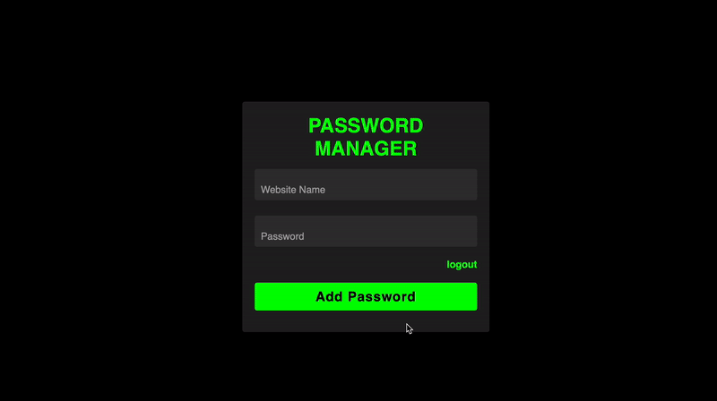

# Password Manager

## Overview
This project is a web-based Password Manager built using Flask, JavaScript, HTML, and CSS. The application provides secure password management features, including user registration, multi-factor authentication (MFA), and encrypted storage of credentials.



## Features
- **User Registration and Login**: Secure user registration and login system with support for multi-factor authentication (MFA).
- **OTP Verification**: Implements one-time password (OTP) verification for enhanced security.
- **Dashboard**: User-friendly dashboard to manage stored passwords.
- **Secure Storage**: Uses encryption for secure storage of passwords.
- **Certificate Generation**: Ability to generate security certificates for secure communication.

## Installation
1. **Clone the repository**:
   ```bash
   git clone https://github.com/nednik19/password-manager
   cd password-manager
   ```

2. **Install the dependencies**:
   ```bash
   pip install -r requirements.txt
   ```

3. **Generate Certificates**:
   The application uses HTTPS for secure communication. You need to generate SSL certificates before running the application.
   ```bash
   python generate_cert.py
   ```
This script will generate a self-signed SSL certificate (“cert.pem”) and a private key (“key.pem”) in the project directory.

## Usage
1. **Run the application**:
   ```bash
   python app.py
   ```

2. **Access the web interface**:
   Open a web browser and navigate to `http://127.0.0.1:5000`.

## Project Structure
- `app.py`: Main entry point for the Flask application.
- `auth.py`: Handles user authentication, including login, registration, and OTP verification.
- `generate_cert.py`: Generates security certificates for secure communication.
- `create_db.py`: Initializes the database for storing user credentials.
- `static/`: Contains static files (CSS, JavaScript).
  - `styles.css`, `style.css`: Styling for the web pages.
  - `script.js`: JavaScript for client-side interactions.
- `templates/`: HTML templates for different pages.
  - `base.html`: Base layout used by other pages.
  - `register.html`, `login.html`, `dashboard.html`, etc.: Individual pages for user interactions.

## Dependencies
- **Flask**: Web framework used for building the application.
- **SQLite**: Database used for storing user credentials.
- **Other Python Packages**: Listed in `requirements.txt`.

## Security

The password manager web application is built with a strong emphasis on security. Below are the key security features:

- **Encryption:**
  - User passwords are hashed using `bcrypt` with unique salts.
  - Sensitive data (stored passwords, MFA secrets) are encrypted using symmetric encryption derived from the user's passkey.
  - The passkey is never stored on the server (zero-knowledge approach).

- **Multi-Factor Authentication (MFA):**
  - Implements Time-Based One-Time Passwords (TOTP) using the `pyotp` library.
  - Users set up MFA during registration by scanning a QR code.

- **Secure Communication:**
  - All data transmission is secured using HTTPS with SSL/TLS certificates.
  - HTTP Strict Transport Security (HSTS) is enabled to enforce HTTPS.

- **Secure Coding Practices:**
  - Input validation and sanitization using the `bleach` library to prevent injection attacks.
  - Account lockout mechanism after multiple failed login attempts.
  - Cross-Site Request Forgery (CSRF) protection using `Flask-WTF`.

- **Session Management:**
  - Secure session cookies with `Secure`, `HttpOnly`, and `SameSite=Lax` attributes.
  - Sessions expire after 30 minutes of inactivity.

- **Security Headers:**
  - Content Security Policy (CSP) implemented to mitigate XSS attacks.
  - Additional headers like `X-Content-Type-Options`, `X-Frame-Options`, and `Referrer-Policy` are set.

- **API Security:**
  - Token-based authentication for API endpoints.
  - Rate limiting implemented using `Flask-Limiter` to prevent abuse.

- **Compliance with Best Practices:**
  - Adheres to OWASP guidelines to mitigate common security risks.
  - Security is integrated from the outset (Secure by Design).

- **Zero-Knowledge Architecture:**
  - Users' passkeys are never stored; only the user can decrypt their data.

- **Regular Security Testing:**
  - Subjected to static and dynamic security testing using tools like Bandit, SQLMap, OWASP ZAP, and Burp Suite.


